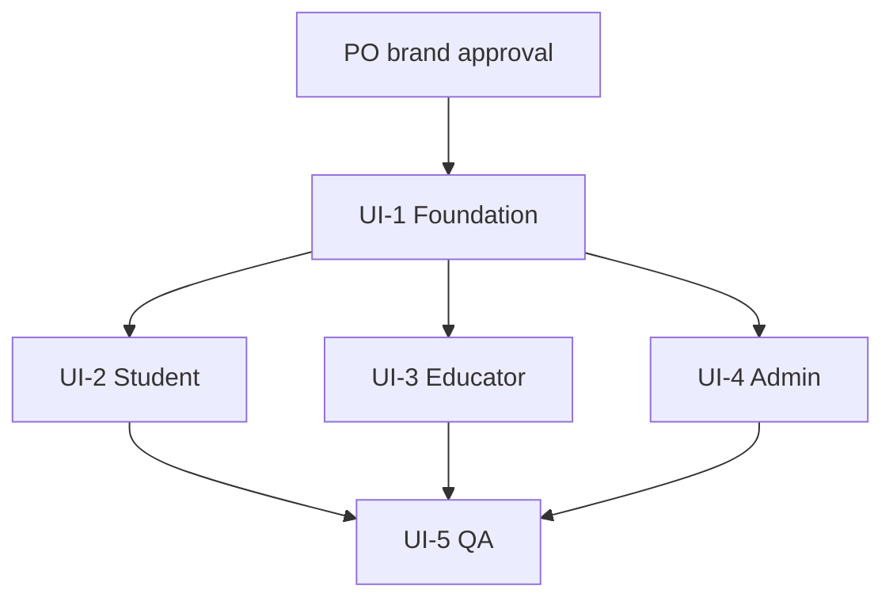

# IncluHub UI Implementation Plan — UI-0

**Date:** 2026-07-14
**Status:** Planning only — controlled implementation packages UI-1 through UI-5
**Prerequisite:** PO approves brand direction (`BRAND_REQUIREMENTS.md`)

---

## Package overview

| Package | Focus | Depends on |
|---|---|---|
| **UI-1** | Tokens, typography, shell, navigation, status system | PO brand decision |
| **UI-2** | Student portal | UI-1 |
| **UI-3** | Educator portal | UI-1 |
| **UI-4** | Admin portal | UI-1 |
| **UI-5** | Responsive, accessibility, visual QA | UI-2, UI-3, UI-4 |

**Explicitly out of scope:** Stage 4/5 features, notifications, new routes, workflow/permission changes, database/RPC changes.

---

## UI-1 — Foundation

### As-built progress

| Slice | Status | Notes |
|---|---|---|
| **UI-1A** | Done | Brand tokens + typography in `globals.css` |
| **UI-1B1** | Done | Desktop shell, official logo in sidebar, tokenized nav, admin “Coming later” badges, broken External links hidden |
| **UI-1B2** | **Done** | Mobile header + Dialog drawer, responsive shell (`md` breakpoint), login branding. **UI-1B complete.** |
| **UI-1C1** | Done | StatusBadge repaired; PortfolioWorkflowBadge + StatusPanel created; workflow labels backend-driven |
| **UI-1C2A** | **Done** | LoadingSkeleton created; EmptyState tokenized; QueryErrorState parameterized with optional retry |
| **UI-1C2B** | **Done** | PageHeader / SectionHeader / DashboardMetricCard; RecordPageHeader wraps PageHeader. **UI-1C complete.** |
| **UI-1D** | **Done** | Foundation verification + controlled repairs. See `docs/design/UI_1_FOUNDATION_VERIFICATION.md`. **UI-1 complete.** |

**UI-1B1 as-built (2026-07-15):**

- Desktop shell: `AppShell` + `RoleLayout` (tokenized page surface, header, sign-out, content area)
- Official logo: `/brand/incluhub-logo.svg` in sidebar (~36px, `object-contain`, alt “IncluHub”) + wordmark + role label
- Active nav: burgundy soft fill + **left border** (non-color-only) + `aria-current="page"`
- Admin placeholders (Project Approvals, Notifications, Activity Logs): visible with **Coming later** badge — visual only
- External Assigned Team / Project Details / Notifications: `hidden` from sidebar until Package E — routes/permissions unchanged
- Duplicate page `p-6` still present on role dashboards and other pages — cleanup deferred to UI-2 / UI-3 / UI-4

**UI-1B2 as-built (2026-07-15):**

- Breakpoint: **`md` (768px)** — desktop sidebar `hidden md:flex`; mobile header `md:hidden`
- Mobile header: logo (~32px) + IncluHub + portal role + menu trigger (`aria-label`)
- Mobile nav: shadcn/Base UI **Dialog** styled as left drawer (no Sheet package); shared `PortalNavList` / same `NavItem` metadata as desktop
- Drawer: focus trap / Escape / backdrop via Dialog; close control; closes on route select; ~44px touch targets; Sign out in footer
- Login: official SVG (~56px) + “IncluHub” + “Education Management System” above existing form — auth logic unchanged
- Skip-to-content link on `AppShell` → `#main-content`
- Shell overflow: `min-w-0 overflow-x-hidden`; mobile content padding `p-4` / desktop `md:p-6`
- **UI-1B complete.** Next: **UI-1C** (status system / shared empty-error-loading primitives)

**UI-1C1 as-built (2026-07-15):**

- Canonical portfolio workflow values (repo source of truth): `locked`, `awaiting_booking`, `awaiting_submission`, `pending_educator`, `pending_admin`, `revision_required`, `completed`
- Labels remain from `PORTFOLIO_WORKFLOW_STATUS_LABELS` / `getPortfolioWorkflowPresentation` — not redesigned
- `StatusBadge` repaired: semantic UI-1A status tokens + icon; still used for generic record/stage statuses; wording via existing underscore title-case
- `PortfolioWorkflowBadge` created for typed workflow statuses + canonical labels
- `StatusPanel` created (`information` | `success` | `warning` | `danger` | `neutral`) — tokenized callout primitive
- Shared intent helpers: `src/lib/status/status-intent.ts`
- **Page-level adoption deferred** to UI-2 / UI-3 / UI-4 (studio/educator/admin amber/green panels and StatusBadge-on-workflow still present)
- **Next: UI-1C2** (LoadingSkeleton, EmptyState/ErrorState token repair, PageHeader)

**UI-1C2A as-built (2026-07-15):**

- `LoadingSkeleton` created (`page` | `cards` | `table` | `list` | `form`) — tokenized pulse bones, `role="status"`, reduced-motion aware; no shadcn Skeleton package present
- `EmptyState` repaired — semantic tokens; optional icon / action / secondaryAction / compact; callers still supply contextual title + description
- `QueryErrorState` repaired — parameterized `title` (fallback “Something went wrong”); `description` + legacy `message` alias; optional manual `retry` (node or `{ label, onClick, href }`); semantic danger tokens; `role="alert"`
- No automatic retries; no permanent loading routes; no role-page mass adoption
- **Deferred adoption:** Student portfolio/workflow, Educator review queue, Admin users list, Admin stage board (UI-2 / UI-3 / UI-4)
- **Next: UI-1C2B** (PageHeader / SectionHeader / DashboardMetricCard)

**UI-1C2B as-built (2026-07-15):**

- `PageHeader` created (`src/components/layout/PageHeader.tsx`) — title (single h1), optional description / eyebrow / metadata / primaryAction / secondaryActions; `bordered` chrome for list pages; tokenized typography + surfaces; responsive action stacking
- `SectionHeader` created — title (h2/h3), optional description / action / count / metadata; compact mode; no h1
- `DashboardMetricCard` created — label / value / description / decorative icon / supportingText / optional href / optional statusIntent accent / loading / compact; linked cards are a single focusable control with brand focus ring
- `RecordPageHeader` converted to a thin compatibility wrapper over `PageHeader` (same props: title, description, count, actions) — existing `@/components/tables/RecordPageHeader` imports unchanged
- Exports: `@/components/layout` (`PageHeader`, `SectionHeader`, `DashboardMetricCard`); RecordPageHeader remains via `@/components/tables`
- **Role-page adoption deferred** (UI-2 / UI-3 / UI-4): Student dashboard / my-stage / portfolio; Educator dashboard / portfolio review list+detail; Admin dashboard / users / stage board / portfolio approvals
- **UI-1C complete.** **Next: UI-1D** (foundation verification / QA — do not start role redesigns)

**UI-1D as-built (2026-07-15):**

- Verification report: `docs/design/UI_1_FOUNDATION_VERIFICATION.md`
- Brand / shell / nav / status / shared states / headers verified against UI-1 acceptance questions
- Controlled repairs only: fixed circular `@theme` radius token self-references in `globals.css`; `StatusPanel` danger uses `role="alert"`
- Role-page zinc / duplicate padding / metric adoption **deferred** to UI-2 / UI-3 / UI-4
- **UI-1 complete.** **UI-2 (Student portal) is safe to start** — do not change loaders/actions/routes/workflows

### Goals

- Design tokens in CSS + Tailwind
- Fix typography wiring (Geist)
- Unified AppShell with mobile navigation
- Semantic status system (including portfolio workflow)
- Shared page headers and loading/empty/error primitives

### Files likely affected

```
src/app/globals.css
src/app/layout.tsx
src/components/layout/RoleLayout.tsx
src/components/layout/Sidebar.tsx
src/lib/permissions/roles.ts          (nav badges only — no URL changes)
src/components/shared/StatusBadge.tsx
src/components/shared/EmptyState.tsx
src/components/shared/QueryErrorState.tsx
src/components/shared/RecordPageHeader.tsx
components.json                       (if shadcn theme sync needed)
tailwind / postcss config             (if present)
```

### Components to create

| Component | Purpose |
|---|---|
| `AppShell` | Wrapper: sidebar + header + content slot |
| `RoleSidebar` | Tokenized sidebar from Sidebar refactor |
| `MobileNavigation` | Drawer / sheet for `< md` |
| `PageHeader` | Universal page title + description + actions |
| `SectionHeader` | In-page section divider |
| `LoadingSkeleton` | Table, card, page variants |
| `DashboardMetricCard` | Standard metric tile |
| `PortfolioWorkflowBadge` | Extends StatusBadge for workflow_status |
| `StatusPanel` | Tokenized info/warning/success/danger callout |

### Components to replace / merge

| Current | Action |
|---|---|
| `Sidebar.tsx` | Merge into `RoleSidebar` |
| `RoleLayout.tsx` | Thin wrapper over `AppShell` |
| Inline page h1 blocks | Replace with `PageHeader` |
| Ad-hoc colored alert divs | Replace with `StatusPanel` |

### Routes affected

- **All authenticated routes** (layout only) — no URL changes
- Nav visibility badges for placeholders (admin ×3, external ×3)

### What NOT to change

- Route paths
- Loaders, actions, RPC calls
- Workflow status values
- Business logic in pages

### Testing checklist

- [ ] Font renders Geist (not system fallback)
- [ ] Sidebar uses semantic tokens (no raw zinc in layout/)
- [ ] Mobile drawer opens/closes; focus trap works
- [ ] StatusBadge covers all portfolio workflow statuses
- [ ] LoadingSkeleton on at least one route per role
- [ ] QueryErrorState accepts custom title
- [ ] Placeholder nav items show “Coming later” badge
- [ ] External broken links hidden or disabled
- [ ] `tsc`, `lint`, `build` pass
- [ ] No visual change to login required in UI-1 (optional)

### Recommended commit boundary

```
feat(ui-1): design tokens, app shell, and status system
```

Single commit or split:

1. `feat(ui-1): design tokens and typography`
2. `feat(ui-1): app shell and mobile navigation`
3. `feat(ui-1): status system and shared states`

---

## UI-2 — Student portal

### As-built progress

| Slice | Status | Notes |
|---|---|---|
| **UI-2A** | **Done** | Full Student portal visual redesign — pages + student-facing studio UI |
| **UI-2B** | **Done** | Stage 3 disposable fixture QA + controlled repair. See `docs/design/UI_2_STUDENT_PORTAL_QA.md`. **UI-2 complete.** |

**UI-2A as-built (2026-07-15):**

- Student dashboard redesigned — `PageHeader`, `DashboardMetricCard`, one primary next-action `StatusPanel`, team sequence, secondary links; duplicate padding removed
- My Team redesigned — tokenized summary + member cards; incomplete-team `StatusPanel`
- My Stage redesigned — `StudentStageJourney` + shared `StepProgress` (complete/current/upcoming/locked with icon + text); Admin `TeamStageTimeline` untouched
- Portfolio workflow unified — own workspace once; team sequence; other portfolios without duplicating own card
- Booking visually updated — brand slot selection, ~44px targets, `StatusPanel` warnings/success; actions/slot logic unchanged
- Revision/resubmission visually updated — warning `StatusPanel` + tokenized forms; fields/actions unchanged
- Timeline — `src/components/status/Timeline.tsx`; `PortfolioVersionHistory` adopts it
- Workflow values/transitions, loaders, server actions, RPCs, booking rules — **unchanged**

**UI-2B as-built (2026-07-15):**

- Disposable Stage 3 fixture: `UI2 QA TEAM` via `scripts/ui2-qa-fixture-setup.mjs` / cleanup via `scripts/ui2-qa-fixture-cleanup.mjs` (Alpha/Beta never modified)
- Full status matrix exercised: locked → awaiting_booking → awaiting_submission → pending_educator → revision_required → resubmit → pending_educator → pending_admin → completed
- Student screens, booking/submission/revision/Timeline, 375px overflow, and keyboard sampling verified
- Controlled repair: `SectionHeader` explicit `h2`/`h3` (hydration risk)
- QA report: `docs/design/UI_2_STUDENT_PORTAL_QA.md`
- **UI-2 complete.** Next portal package: **UI-3 Educator**

### Goals

- Portfolio page unified layout (highest priority)
- Dashboard and stage panels consistent
- Booking/resubmit mobile-friendly
- Version history via shared Timeline

### Files affected (UI-2A / UI-2B)

```
src/app/student/**
src/components/student/*
src/components/studio/* (student-facing visual only)
src/components/status/Timeline.tsx
src/components/layout/SectionHeader.tsx (UI-2B hydration repair)
scripts/ui2-qa-fixture-setup.mjs
scripts/ui2-qa-fixture-cleanup.mjs
docs/design/UI_2_STUDENT_PORTAL_QA.md
```

### What NOT to change

- `resubmit_portfolio` RPC integration
- Booking server actions
- Portfolio loader query shape
- Stage gating logic

### Testing checklist (UI-2B)

- [x] Portfolio page: booking → submit → review → revision → resubmit flow
- [x] Booking grid usable at 375px width
- [x] Version history readable and ordered
- [x] One primary action visible per portfolio state
- [x] Empty/error states distinct
- [x] Dashboard CTA not duplicated unnecessarily
- [x] Keyboard: slot selection and form submit (sampled)

### Recommended commit boundary

```
test(ui-2b): verify Student Stage 3 workflow and fix SectionHeader hydration
```

---

## UI-3 — Educator portal

### As-built progress

| Slice | Status | Notes |
|---|---|---|
| **UI-3A** | **Done** | Full Educator portal visual redesign — dashboard, lists, review queue + detail |
| **UI-3B** | **Done** | Disposable Stage 3 fixture QA + revision/approval verification. See `docs/design/UI_3_EDUCATOR_PORTAL_QA.md`. **UI-3 complete.** |

**UI-3A as-built (2026-07-15):**

- Educator dashboard redesigned — `PageHeader`, `DashboardMetricCard` summary, pending-review `StatusPanel` (one primary reviews CTA), preview cards via `ReviewCard`, secondary My Teams / My Students links; duplicate `p-6` removed
- My Teams and My Students standardized — tokenized cards/table; mobile student cards + desktop table; contextual empty/error titles; `PortfolioWorkflowBadge` for workflow
- Review queue redesigned — `ReviewCard` with Student/team/discipline/version/date + workflow badge + Open Review
- Review detail converted into structured workspace — `ProfileSummary`, current submission, shared `Timeline` via `ReviewHistory`, single `ActionPanel` (sticky desktop) wrapping existing review form
- Timeline adoption — educator history maps into shared `Timeline` (order/fields preserved; no invented events)
- Workflow logic / loaders / server actions / RPCs / permissions / routes — **unchanged**

**UI-3B as-built (2026-07-15):**

- Disposable Stage 3 fixture: `UI3 QA TEAM` via `scripts/ui3-qa-fixture-setup.mjs` / cleanup via `scripts/ui3-qa-fixture-cleanup.mjs` (Alpha/Beta never modified)
- Workflow verified: awaiting_submission → submit → pending_educator → revision_required → resubmit → pending_educator → approve → pending_admin
- Dashboard count/queue/ReviewCard/detail ActionPanel, Timeline history, unrelated-educator 404, and Admin-RPC denial verified
- No presentation repairs required beyond UI-3A
- QA report: `docs/design/UI_3_EDUCATOR_PORTAL_QA.md`
- **UI-3 complete.** Next portal package: **UI-4 Admin**

### Goals

- Review detail as structured workspace
- Shared review components with admin
- Dashboard token polish

### Files affected (UI-3A / UI-3B)

```
src/app/educator/**
src/components/educator/*
  ReviewCard.tsx, ProfileSummary.tsx, ActionPanel.tsx (UI-3A)
scripts/ui3-qa-fixture-setup.mjs
scripts/ui3-qa-fixture-cleanup.mjs
docs/design/UI_3_EDUCATOR_PORTAL_QA.md
```

### Components created

| Component | Purpose |
|---|---|
| `ReviewCard` | Submission summary for queue / dashboard previews |
| `ActionPanel` | Sticky review actions (approve/revise) |
| `ProfileSummary` | Student/team compact header |

### Components replaced

| Current | Action |
|---|---|
| `ReviewHistory` | Maps into shared `Timeline` |
| Educator metric cards | Use `DashboardMetricCard` |

### Routes affected

- `/educator/*` (all four nav routes + review detail)

### What NOT to change

- Review submission actions / RPCs
- Educator permission checks
- Portfolio review loader filters

### Testing checklist (UI-3B)

- [x] Review queue list with empty state
- [x] Review detail: pending / revision / resubmit / pending_admin display correctly
- [x] Review form preserves data on validation error
- [x] ActionPanel visible without excessive scroll (desktop)
- [x] History matches shared Timeline pattern
- [x] Approve / revision actions remain functional

### Recommended commit boundary

```
test(ui-3b): verify Educator revision and approval workflow
```

---

## UI-4 — Admin portal

### Goals

- Portfolio approval alignment with educator review UI
- Stage board responsive behavior
- Studio schedule mobile pass
- Admin dashboard metrics expansion (visual only — same data)
- CRUD list consistency

### Files likely affected

```
src/app/admin/dashboard/page.tsx
src/app/admin/portfolio-approvals/*
src/app/admin/stages/page.tsx
src/app/admin/studio-schedule/page.tsx
src/app/admin/users/*
src/app/admin/students/page.tsx
src/app/admin/educators/page.tsx
src/app/admin/teams/*
src/app/admin/programs/*
src/app/admin/institutes/*
src/app/admin/external-members/page.tsx
src/components/admin/*
```

### Components to create

| Component | Purpose |
|---|---|
| `DataTable` | Table + loading + empty + error slots |
| `FilterBar` | Search/filter row for lists |
| `StageBoardColumn` | Responsive stage board unit |

### Components to replace

| Current | Action |
|---|---|
| `SubmissionVersionHistory` | Merge into `Timeline` |
| Admin approval panels | Share `ReviewCard` / `ActionPanel` with educator |
| Inline admin dashboard | `PageHeader` + `DashboardMetricCard` |

### Routes affected

- All `/admin/*` implemented routes
- Placeholder pages: visual only (PlaceholderPage styling) — **no new features**

### What NOT to change

- Admin approval RPC/actions
- Stage board data logic
- User create forms server-side validation
- Placeholder route URLs (keep; nav badge only)

### Testing checklist

- [ ] Portfolio approval detail matches educator patterns
- [ ] Stage board: mobile column stack or horizontal scroll with affordance
- [ ] Studio schedule touch targets
- [ ] Users list QueryErrorState shows contextual title
- [ ] All tables have empty states
- [ ] Admin dashboard uses metric cards consistently

### Recommended commit boundary

```
feat(ui-4): admin portal visual system
```

---

## UI-5 — Responsive, accessibility, and visual QA

### Goals

- Full responsive pass
- WCAG 2.1 AA fixes
- Cross-role visual consistency audit
- Remove remaining hardcoded colors
- Documentation update

### Files likely affected

```
All src/components/**
All src/app/**/page.tsx
docs/design/*                     (update with as-built notes)
```

### Components to verify

- AppShell / MobileNavigation
- All status communications (icon + text)
- Focus states on custom controls (StudioSlotGrid)
- Skip link (add to AppShell)
- Live regions for async status

### Routes affected

- All authenticated routes
- Login (optional contrast pass)

### What NOT to change

- Features, routes, backend

### Testing checklist

- [ ] 375px, 768px, 1280px viewports for student portfolio + admin stage board
- [ ] axe or Lighthouse accessibility scan — no critical issues
- [ ] Keyboard-only navigation all portals
- [ ] Color contrast AA on status panels and badges
- [ ] No color-only status (icons or labels present)
- [ ] grep: zero unjustified `zinc-*` / `amber-*` in components (except token definitions)
- [ ] Cross-role screenshot comparison for review/approval screens
- [ ] `tsc`, `lint`, `build` pass

### Recommended commit boundary

```
feat(ui-5): responsive accessibility and visual QA
```

---

## UX rules (apply across UI-1–UI-5)

1. **One primary action per screen** — secondary actions visually subordinate
2. **Status text must match `workflow_status`** — design styles, never renames
3. **No action buttons for unauthorized roles** — hide, don’t disable-with-tooltip unless necessary
4. **Destructive actions require confirmation** — ConfirmationDialog
5. **Loading must not look like empty data** — LoadingSkeleton required
6. **Empty state must explain next action** — EmptyState with CTA where applicable
7. **Errors must not expose technical details** — user-safe copy + optional retry
8. **Mobile actions must remain accessible** — sticky footers, 44px touch targets
9. **Forms preserve entered data on validation errors** — maintain current server action behavior
10. **Consistent success/error feedback** — StatusPanel / toast pattern (pick one in UI-1)
11. **No color-only status communication** — icon or text label required
12. **Keyboard focus states required** — visible ring on all interactives

---

## Role-specific information architecture (existing routes)

### Student (recommended nav order — unchanged URLs)

1. Dashboard
2. My Team
3. My Stage
4. Portfolio

All remain **visible**. Portfolio is primary Stage 3 destination.

### Educator (unchanged)

1. Dashboard
2. Portfolio Reviews ← primary operational entry
3. My Teams
4. My Students

All remain **visible**.

### Admin (unchanged URLs; nav display recommendations)

| Item | Route | Recommendation |
|---|---|---|
| Dashboard | `/admin/dashboard` | Visible |
| Users | `/admin/users` | Visible |
| Institutes | `/admin/institutes` | Visible |
| Programs | `/admin/programs` | Visible |
| Students | `/admin/students` | Visible |
| Educators | `/admin/educators` | Visible |
| External Members | `/admin/external-members` | Visible |
| Teams | `/admin/teams` | Visible |
| Stages | `/admin/stages` | Visible |
| Studio Schedule | `/admin/studio-schedule` | Visible |
| Portfolio Approvals | `/admin/portfolio-approvals` | Visible — emphasize |
| Project Approvals | `/admin/project-approvals` | **Coming later** badge |
| Notifications | `/admin/notifications` | **Coming later** badge |
| Activity Logs | `/admin/activity-logs` | **Coming later** badge |

### External (unchanged URLs; nav display recommendations)

| Item | Route | Recommendation |
|---|---|---|
| Dashboard | `/external/dashboard` | Visible |
| Assigned Team | `/external/assigned-team` | **Hide or Coming later** (404 today) |
| Project Details | `/external/project-details` | **Hide or Coming later** (404 today) |
| Notifications | `/external/notifications` | **Hide or Coming later** (404 today) |

---

## Shared component system — final recommendations

| Component | Verdict |
|---|---|
| `AppShell` | **Create** (UI-1) |
| `RoleSidebar` | **Create** from Sidebar (UI-1) |
| `MobileNavigation` | **Create** (UI-1) |
| `PageHeader` | **Create**; supersede ad-hoc h1 (UI-1) |
| `SectionHeader` | **Create** (UI-1) |
| `DashboardMetricCard` | **Create** (UI-1) |
| `StatusBadge` | **Repair** (UI-1) |
| `PortfolioWorkflowBadge` | **Create** (UI-1) |
| `EmptyState` | **Keep** (UI-1 token pass) |
| `ErrorState` / `QueryErrorState` | **Repair** (UI-1) |
| `LoadingSkeleton` | **Create** (UI-1) |
| `DataTable` | **Create** (UI-4) |
| `FilterBar` | **Create** (UI-4) |
| `ActionPanel` | **Create** (UI-3) |
| `Timeline` | **Create**; retire 3 history components (UI-2/3) |
| `ReviewCard` | **Create** (UI-3) |
| `ProfileSummary` | **Create** (UI-2/3) |
| `ConfirmationDialog` | **Create** (UI-2) |
| `FormSection` | **Create** (UI-2) |
| `StepProgress` | **Create** (UI-2) |
| `PortfolioStatusPanel` | **Create** (UI-2) |
| `PlaceholderPage` | **Keep** — restyle (UI-4) |
| `RecordPageHeader` | **Merge** into PageHeader (UI-1) |
| shadcn primitives | **Keep** — token wire-up |

---

## Dependency diagram



---

## Estimated sequencing

| Week | Package | Outcome |
|---|---|---|
| 1 | UI-1 | Tokens + shell + status — all roles slightly better |
| 2 | UI-2 | Student portfolio mobile-ready |
| 3 | UI-3 | Educator review workspace |
| 4 | UI-4 | Admin approvals + stage board |
| 5 | UI-5 | QA + accessibility + cleanup |

(Timeline indicative — adjust with team capacity.)

---

## Stop conditions

- Do not start UI-2 until UI-1 tokens and shell are merged
- Do not invent brand colors — use `TBD_REPLACE` or provisional indigo until PO signs off
- Do not implement Package E, notifications, or Stage 4/5 UI
